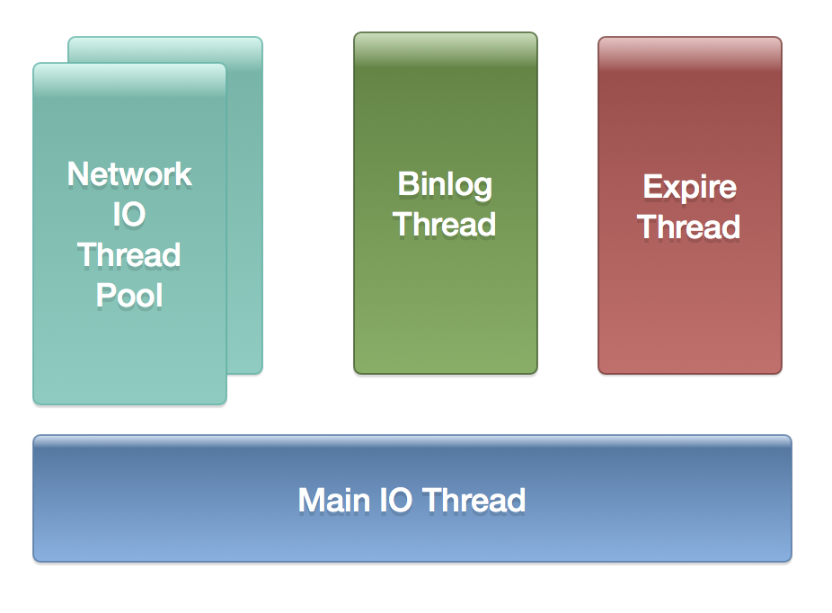
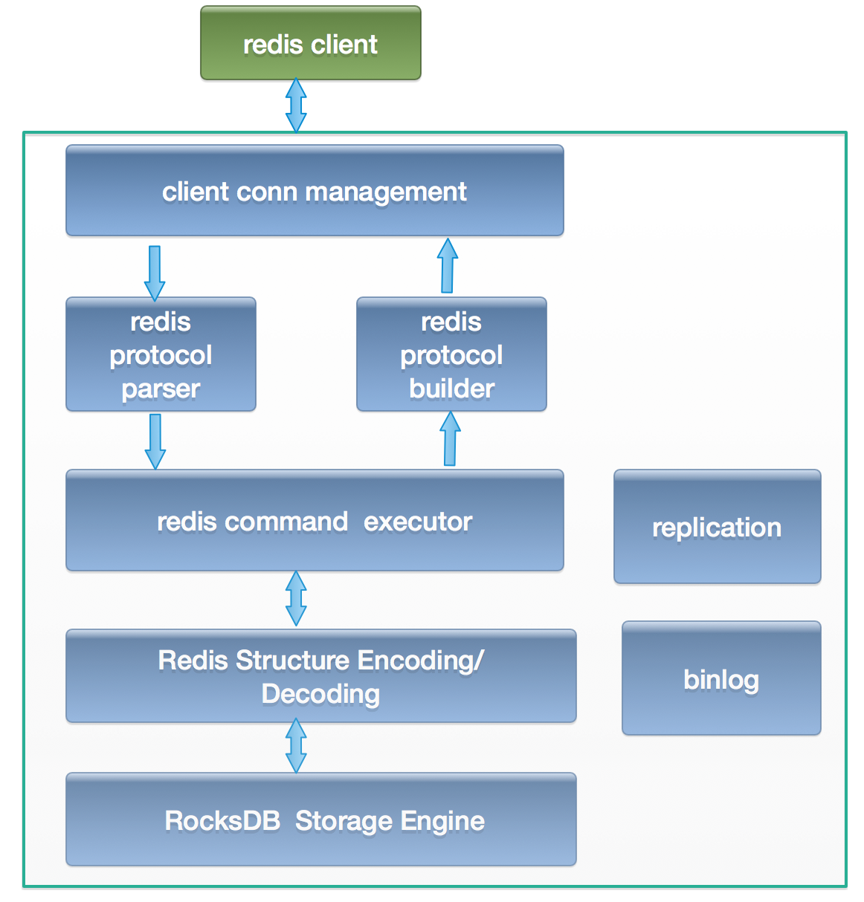
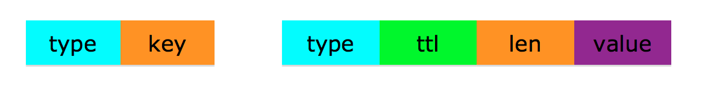
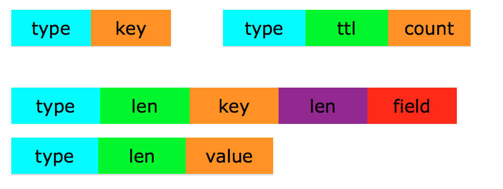
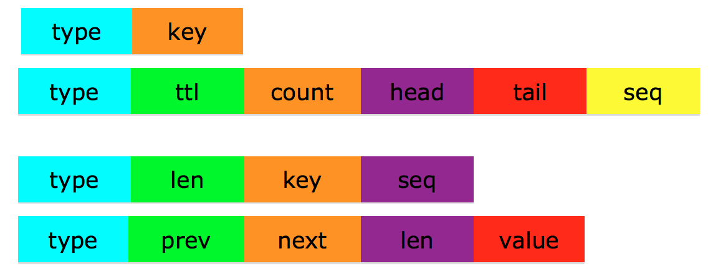
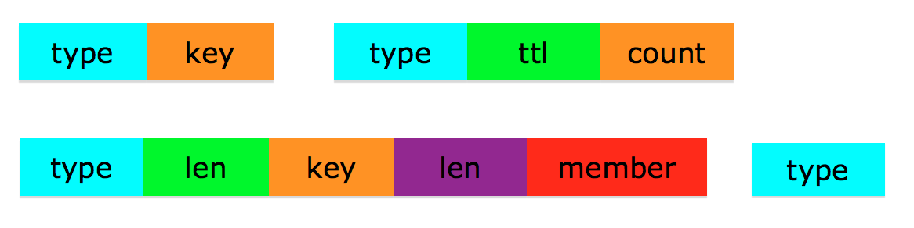
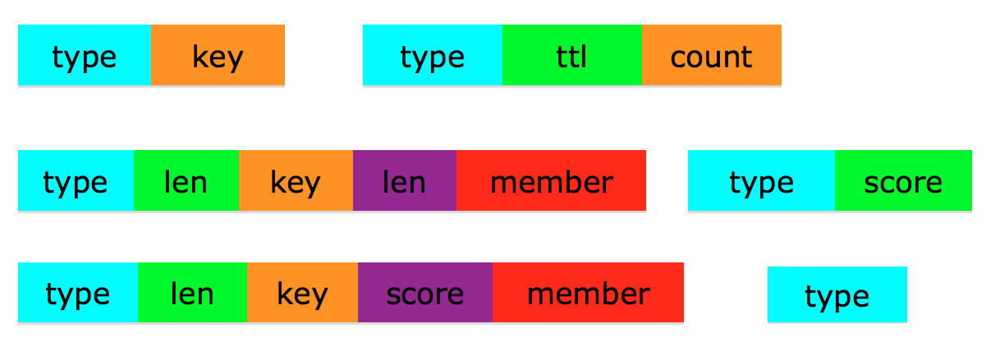
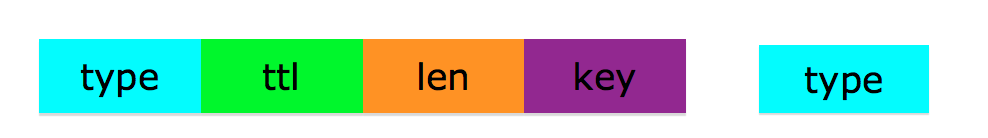
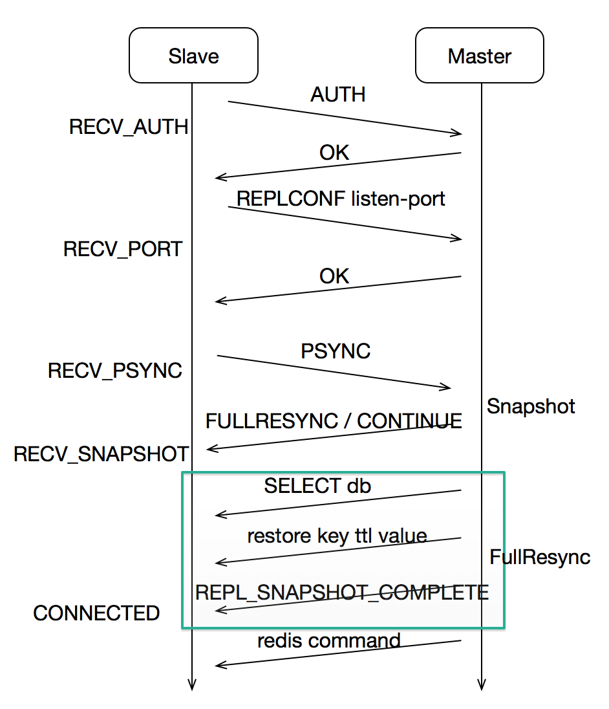

## 1. 简介
kedis-server是一个基于 [RocksDB](https://github.com/facebook/rocksdb) 的kv存储服务器，同时兼容了[Redis](https://redis.io/)的协议和命令，所以可以用Redis的客户端直接和kedis-server通讯

kedis-server主要是为了解决Redis服务器的内存容量限制问题，用磁盘和SSD替换内存存储，来削减kv存储的成本

## 2. 网络和线程模型
网络模型采用多线程reactor模型，具体细节可以参考Doug Lea的 [Scalable IO in Java](http://gee.cs.oswego.edu/dl/cpjslides/nio.pdf)

1）主线程是一个EventLoop，用于监听客户端的连接。

2）一个网络IO线程池，每个线程是一个EventLoop，所有连接的IO操作都在IO线程里面进行，两种情况会把连接注册到IO线程的Eventloop: 

* 主线程的Eventloop接受一个客户端连接
* 在任意一个线程中，通过Connect()接口连接其他服务后

注册之后，对一个连接来说，所有的事件触发都在同一个IO线程里面完成, 读取事件之后对应的操作也在相同的IO线程里面完成，但不同连接可能在不同的IO线程，所以如果要修改一些全局的数据结构，需要加线程锁。这种模式下，如果一个操作耗时很长，会卡住注册在这个线程上的所有客户端连接，但其他IO线程的连接请求不受影响

3）一些后台处理线程，比如通过TTL来删除key的检测线程，binlog清理线程

总的线程模型图如下所示

## 3. 架构

## 4. 存储引擎编码格式
由于RocksDB是一种简单的kv存储引擎，要实现Redis的那些复杂数据结构和支持TTL，需要精心设计存储的编码格式，来实现Redis的string, hash, list, set, sorted set这五种数据类型

每种类型都有一个元数据信息，来表示数据类型，TTL值和元素个数。具体数据的元素则保存在实体数据信息里面，只有string类型的数据，这两种类型保存在了一起

具体的编码实现如下：

### 一些约定

type占用1个字节

len表示key或者value的长度，用变长整型编码表示：

	高位第一个bit是0，用1个字节的剩下7个bit表示长度
	高位前两个bit是10，用2个字节剩下的14个bit表示长度
	高位前两个bit是11，用4个字节剩下的30个bit表示长度

整型数据都用**大端字节序**存储

ttl占用8个字节，是一个超时时间戳，单位毫秒，如果为0，表示key没有设置超时

count占用8个字节，表示复杂数据类型中一个key里面的元素个数

### 4.1 string类型

对应到RocksDB的key编码有type, key两个字段组成

* type=1，表示KEY_TYPE_META
* key是实际用户设置的键

所有数据类型的元数据的key编码类型都是这种形式，这样就保证一个DB号下面，key不会重复，具体的数据类型区分是根据元数据value编码下的type来决定的

key之前没有len字段，这样所有的key都会按字典顺序进行排序，方便scan操作

对应到RocksDB的value编码有type，ttl，len，value 四个字段组成

* type=2， 表示KEY_TYPE_STRING
* ttl是超时时间戳
* len是value的长度
* value是实际用户设置的值

### 4.2 hash类型

元数据信息的key编码也是有type，key两个字段组成，和string类型的完全一致
元数据信息的value编码有type, ttl, count三个字段组成

* type=3, 表示KEY_TYPE_HASH
* ttl是超时时间戳
* count是hash类型中field的个数，这样类似hlen这样的命令，一次DB读取就可以获取

key里面每个filed，都有独立的kv编码来表示， field的key编码有type, len, key, len, field五个字段表示

* type=4, 表示KEY_TYPE_HASH_FIELD
* 第一个len是key的长度
* key是hash结构的key
* 第二个len是field的长度
* field是hash结构里面的一个元素

field的value编码有type, len, value三个字段表示

* type=4, 表示KEY_TYPE_HASH_FIELD
* len是value的长度
* value是真实的值

### 4.3 list类型

元数据信息的key编码也是有type, key两个字段组成，和string类型的完全一致
元数据信息的value编码有type, ttl, count, head, tail, seq六个字段组成

* type=5, 表示KEY_TYPE_LIST
* ttl是超时时间戳
* count是list元素的个数
* head是list的头部序号, 占用8个字节
* tail是list的尾部序号，占用8个字节， list是一个双向列表，有队列头尾指针，每个元素里面有前后指针
* seq是当前这个key的list分配的序号，占用8个字节，每次添加一个元素时，该序号需要自增+1

key里面每个element，都有独立的kv编码来表示
element的key编码由type, len, key, seq四个字节组成

* type=6, 表示KEY_TYPE_LIST_ELEMENT
* len是key的长度
* key是list的key
* seq是该element对应的序列号，占用8个字节

element的value编码由type, prev, next, len, value五个字段组成

* type=6, 表示KEY_TYPE_LIST_ELEMENT
* prev是该元素前一个元素的序列号
* next是该元素后一个元素的序列号
* len是value的长度
* value是该元素的值

### 4.4 set类型

元数据信息的key编码也是有type key两个字段组成，和string类型的完全一致
元数据信息的value编码有type, ttl, count三个字段组成

* type=7, 表示KEY_TYPE_SET
* ttl是超时时间戳
* count是set元素的个数

member元素的key编码格式，有type, len, key, len, member五个字段组成

* type=8, 表示KEY_TYPE_SET_MEMBER
* 第一个len是key的长度
* key是set的key
* 第二个len是member的长度
* member是set里面的一个元素

member元素的value，只有type一个字段，type=8，表示KEY_TYPE_SET_MEMBER

### 4.5 sorted set类型

元数据信息的key编码也是有type，key两个字段组成，和string类型的完全一致
元数据信息的value编码有type, ttl, count三个字段组成

* type=9, 表示KEY_TYPE_ZSET
* ttl是超时时间戳
* count是zset元素的个数

zset和其他复杂数据结构的编码区别是，它需要两个kv来表示实际的一个元素信息，一个是用于通过member来获取score，一个是用score在RocksDB里面的key排序，来实现zset的member排序

member元素的key编码格式，有type, len, key, len, member五个字段组成

* type=10, 表示KEY_TYPE_ZSET_SCORE
* 第一个len是key的长度
* key是zset的key
* 第二个len是member的长度
* member是zset里面的一个元素

member元素的value编码格式，只有type，score两个字段

* type=10，表示KEY_TYPE_ZSET_SCORE
* score是一个8个字节的有符号整型

用于排序的member元素的key编码格式，有type, len, key, score, member五个字段组成

* type=11, 表示KEY_TYPE_ZSET_SORT
* len是key的长度
* key是zset的key
* score是一个8个字节的无符号整型，表示member的分值
* member是zset里面的一个元素

用于排序的member元素的value，只有type一个字段，type=11，表示KEY_TYPE_ZSET_SORT

编码里面的score不同于zset实际的score，具体的转换关系，详见[zset double支持文档](zset_double_score_design.md)

当zset的所有元素的score相同时，会按member的字典顺序排序，这也是为什么member前面没有len的原因，不然len也会参与到排序，就不是严格按照member的字典顺序排序了

### 4.6 ttl

key的编码有type, ttl, len, key四个字段组成

* type=12, 表示KEY_TYPE_TTL
* ttl是超时字段
* len是key的长度
* key是键

value编码就只有一个字段，type是key的类型，删除key的时候会用到

对于设置了TTL值的kv数据结构，需要添加这个键值对，主要目的是为了实现服务器主动的TTL超时检查来删除key，主要原理是，由于RocksDB的key是有序的，遍历KEY_TYPE_TTL类型的数据时，是按照ttl的值从小到大排序的，所以后台线程可以定时去主动删除ttl小于当前时间戳的那些key

## 5. Replication
主从复制功能其实是要实现全量同步和增量同步这两个功能，实现的流程设计如下，主要是需要实现一个状态机：

1. slave如果配置了masterauth选项，则发送"AUTH password"到master，进入RECV_AUTH状态，没有则跳到步骤3
2. slave收到OK的回复
3. slave发送"REPLCONF listening-port port"到master，进入RECV_PORT状态
4. slave收到OK的回复
5. slave发送"PSYNC binlog_id expect_binlog_seq"到master，进入RECV_SYNC状态
6. slave收到CONTINUE的回复，则表示master上有slave请求的binlog，slave进入CONNECTED状态，直接进入增量同步阶段
7. slave收到FULLRESYNC的回复，则表示master会发送全量snapshot过来，slave进入RECV_SNAPSHOT状态，此后master会一直发送"SELECT db"和"RESTORE key ttl serialized-value"的数据过来，直到slave收到"REPL_SNAPSHOT_COMPLETE binlog_id cur_db_idx max_binlog_seq", 表示slave接收到了所有的snapshot数据，slave进入CONNECTED状态，进入增量同步阶段

## 6. 实现的一些细节
* select命令的实现，kedis-server允许Redis的select命令，通过RocksDB接口里面ColumnFamily实现的，不同的db号对应不同的ColumnFamily
* 由于对于key的大部分命令都涉及多次读取和写入操作，如果写入中间失败，会造成数据结构的损坏，导致以后对这个key的请求都失败，所以需要在操作开始前，基于key来加锁，同时对于多次写入，用RocksDB的WriteBatch来实现原子操作
* HyperLogLog的实现代码，直接从Redis相关部分的代码修改而来，如果要了解里面的原理，需要大概看一下代码注释里面的那些paper

## 7. Roadmap
* 实现大部分常用的Redis命令(finish)
* 实现master-salve主备模式(finish)
* 迁移Redis的部分测试用例作为kedis的测试用例(finish)
* 优化服务的性能(continue)
* 实现所有的Redis命令
* 数据迁移工具
	* kedis之间迁移数据的工具kedis_port (finish)
	* redis迁移数据到kedis的工具redis_to_kedis (finish)
	* kedis迁移数据到redis的工具kedis_to_redis
	
